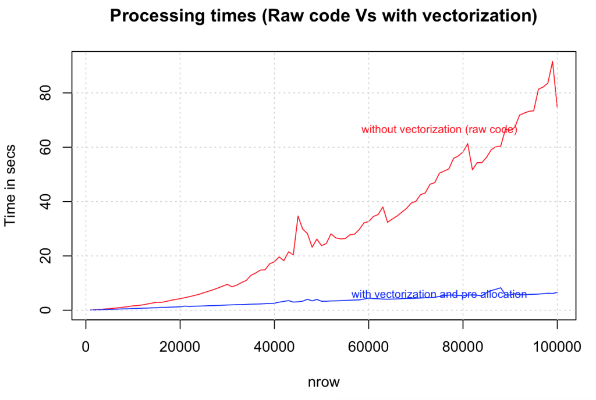
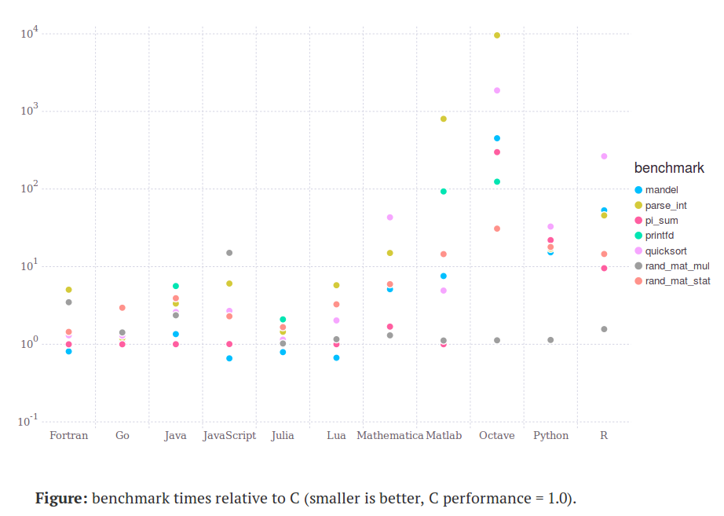

```{r setup, include=FALSE}
options(htmltools.dir.version = FALSE)
```


---
# Required Packages
Install needed packages:
```{r, eval=FALSE}
# setwd(~/source/file/location/)
install.packages('ggplot2')
install.packages('dplyr')
install.packages('broom')
install.packages('microbenchmark')
devtools::install_github('hadley/lineprof')
```

```{r, results='hide', warning=FALSE, message=FALSE}
library(ggplot2)
library(dplyr)
library(broom)
library(microbenchmark)
library(lineprof)
```


---

# Topics


1. Using <code>dplyr</code> Functions

--

2. Examples with %>%

--

3. Performant Code

--

4. Vectorisation

--

5. Profiling


---

# Some Resources for R

* [Data Carpentry Lessons for R](http://www.datacarpentry.org/R-ecology-lesson/)

* [dplyr Tutorial](http://genomicsclass.github.io/book/pages/dplyr_tutorial.html)

* [Advanced R](http://adv-r.had.co.nz/)

* [R for Data Science](http://r4ds.had.co.nz/)

---

# <code>dplyr</code>

* <code>dplyr</code> is a package designed for easy and efficient data manipulation

* Fast enough to work with large(ish) data sets

* *tidyverse* philosophy: collection of small, simple functions that each do one thing well

* Written by Hadley Wickham, Chief Scientist for R Studio, who also developed:

    + <code>ggplot2</code>

    + <code>reshape2</code>

    + <code>tidyr </code>

    + many others

---
# Key Functions

* <code> mutate</code>: transform variables in a data set

* <code> filter</code>: select subset of rows (observations)

* <code> select</code>: select subset of columns (variables)

* <code> arrange</code>: reorder rows

* <code> summarise</code>: collapses a data frame into a single row


---
# Simple <code>dplyr</code> Examples
* Let's try some <code>dplyr</code> functions with the <code>iris</code> data set:
```{r}
data(iris)
iris <-  filter(iris, Species!="setosa")
iris <- select(iris, c(Sepal.Width, Species)) 
iris <- group_by(iris, Species)
iris <- summarise(iris, mean(Sepal.Width))
print(iris)
```

* Note that each function has the form <code>f(data, ...)</code>: first 
argument is a data frame, second argument indicates what 
to do with the data frame.
* Each function is designed to perform a single specific type of operation on a data frame.
* Data can be cleaned and organized by chaining these operations together.

---
# Introducing <code>%>%</code>
* <code>dplyr</code> (and much of the *tidyverse*) is designed around the use of 
the pipe operator <code>%>%</code>

* The pipe operator <code>%>%</code> allows you to chain operations on a data set together 
without having to create specific intermediate objects

* When using %>%, the first argument to a function is taken as the output of the previous step in the chain

* For example, the following is equivalent to the previous code:
```{r}
data(iris)
iris %>% filter(Species!="setosa") %>%
    select(c(Sepal.Width, Species)) %>% 
    group_by(Species) %>%
    summarise(mean(Sepal.Width))
```

---
# <code>dplyr</code> Exercises

1. Use <code>dplyr</code> to calculate the mean Sepal Width of the virginica species.

2. <code>summarise</code> can summarise multiple variables simultaneously, apply a 
different function to each variable.  
Adapt the following code to find the minimum, median, 
maximum, and standard deviation of the Sepal.Width for the virginica species.

3. <code>group_by()</code> makes <code>summarise</code> even more useful by allowing you 
to summarise values across groups of a category simultaneously.  
Using <code>group_by</code>, adapt your code from the previous problem to produce the summary values for each species.


**Modify this code for problems 2 and 3:**
```{r, eval=FALSE}
data(iris)
iris %>% summarise(mean_sepal_width = mean(Sepal.Width),
                   min_sepal_width = min(Sepal.Width))
```


---
class: center, middle
# Performant Code

>“We should forget about small efficiencies, say about 97% of the time: premature optimization is the root of all evil. Yet we should not pass up our opportunities in that critical 3%. A good programmer will not be lulled into complacency by such reasoning, he will be wise to look carefully at the critical code; but only after that code has been identified.”
Donald Knuth.


---
# Performant Code

* When writing code, there are many different resources to consider:
    + Speed
    + Memory
    + Developer Time
    + Reusability

* We want to make the data analysis process easy, convenient, and reliable, not to 
write the fastest code possible.

* Goal: learn easy methods and tools to reduce the time and burden of programming 
for data analysis.
    + Vectorisation
    + Profiling tools
    + Design principles

---
# Performant Code

**Procedures** (from [Advanced R](adv-r.had.co.na/Profiling.html#improve-perf])):

1. Identify the bottlenecks in a script with profiling tools.
    + <code>microbenchmark</code>
    + <code>lineprof</code>
2. Look for existing solutions.
    + Published packages
    + StackOverflow
3. Vectorise.
    + <code> apply, lapply </code>
    + Specialized functions, e.g. <code>colSums, rowSums
4. Parallelise.
5. Avoid copying code uncessarily; avoid superfluous copies of data and variables.
6. Byte-code compile.
7. Rewrite in a faster language (C++, Rcpp, Julia).


---
# Vectorisation

* R is **bad** with "native" <code>for</code> loops, due to various aspects of 
R's design

* Vectorised functions in R tend to be much faster than equivalent loops.

* The underlying loops of the vectorised fucntions are implemented in a lower level 
language like C, which can greatly improve runtimes.

* Key functions:
    + **<code>apply(X, MARGIN, FUN)</code>:** Apply function FUN to matrix/array X, across the dimension(s) specified by MARGIN.
    
    + **<code>sapply(X, FUN)</code>:** Apply a function to a list of vectors, lists, or similar, and returns a vector or matrix by default.

---
# Vectorisation: Iris Example

Suppose we want to calculate the mean of all the numeric variables in the <code>iris</code> 
data set.

```{r}
data(iris)
head(iris)
# With a loop:
iris_means <- c()
for (i in 1:4) {
    iris_means[i] <- mean(iris[, i])
}

# Vectorised:
iris_means <- apply(iris[, -5], 2, mean)
```

---
# Vectorisation: Iris Example
Let's use vectorisation to calculate 95% bootstrap confidence intervals for the 
median Sepal.Length for each iris species.

**Part A**
First, use <code>group_by</code> and <code>summarise</code> to calculate the median Sepal Length of each species.  Then plot density/histogram plots of the distributions 
of Sepal Lengths for the three species using <code>ggplot</code>.

---
# Vectorisation: Iris Example
**Part A**
*Solution*

```{r, fig.height=2.6}
iris_medians <- group_by(iris, Species) %>%
    summarise(median(Sepal.Length))

ggplot(iris, aes(Sepal.Length, fill=Species)) + 
    geom_density(alpha = 0.3) + 
    geom_vline(aes(xintercept = iris_medians[, 2]))
```

---
# Vectorisation: Iris Example
**Part B**

Suppose we want to print the lower and upper 95\% bootstrap estimates, along with the sample median Sepal Length.  Clean up and rewrite the following bootstrap code using vectorisation and <code>dplyr</code> functions. (Hint: the <code>boostrap()</code> 
function from <code>broom</code> makes bootstrap sampling easy.)

---
# Vectorisation: Iris Example
**Part B**

```{r, eval=FALSE}
data(iris)
set.seed(1234)
B <- 1000 # Number of bootstrap samples
n <- 50 # There's 50 of each species in the data set

# This code calculates bootstrap samples for just "setosa"
setosa <- subset(iris, Species == "setosa")
boot_samples <- matrix(nrow=B, ncol=n)
boot_medians <- c()
for (b in 1:B) {
    boot_samples[b, ] <- sample_n(setosa, n, replace=TRUE)[, "Sepal.Length"] 
    boot_medians[b] <- median(boot_samples[b, ])
}

boot_median_est <- mean(boot_medians)
boot_lower <- boot_medians[order(boot_medians)][round(0.025*B)]
boot_upper <- boot_medians[order(boot_medians)][round(0.975*B)]
```


---
# Vectorisation: Iris Example
**Part B**
*Solution*

Use the <code>boostrap()</code> function.
```{r, eval=FALSE}
data(iris)
set.seed(1234)
B <- 1000 # Number of bootstrap samples
n <- 50 # There's 50 of each species in the data set

# This code calculates bootstrap samples for just "setosa"
setosa <- subset(iris, Species == "setosa")
boot_samples <- matrix(nrow=B, ncol=n)
boot_medians <- c()

boot_samples <- bootstrap(setosa, B)

boot_median_est <- mean(boot_medians)
boot_lower <- boot_medians[order(boot_medians)][round(0.025*B)]
boot_upper <- boot_medians[order(boot_medians)][round(0.975*B)]
cat("Est Median Sepal Length: ", boot_median_est, "\n", 
    "95% Bootstrap CI for Median Sepal Length: (", 
    boot_lower, ",", boot_upper, ")\n")
```

---
# Vectorisation: Iris Example
**Part B**
*Solution*

Replace <code>subset</code> with <code>filter</code>, and remove extraneous declarations.
```{r, eval=FALSE}
data(iris)
set.seed(1234)
B <- 1000 # Number of bootstrap samples
n <- 50 # There's 50 of each species in the data set

# This code calculates bootstrap samples for just "setosa"
setosa <- filter(iris, Species == "setosa")

boot_samples <- bootstrap(setosa, B)
```

---
# Vectorisation: Iris Example
**Part B**
*Solution*

Calculate medians for each replicate using <code>do</code> and <code>tidy</code>.
```{r, eval=FALSE}
data(iris)
set.seed(1234)
B <- 1000 # Number of bootstrap samples
n <- 50 # There's 50 of each species in the data set

# This code calculates bootstrap samples for just "setosa"
setosa <- filter(iris, Species == "setosa")

boot_samples <- bootstrap(setosa, B)
boot_medians <- boot_samples %>% do(tidy(median(.$Sepal.Length)))
```


---
# Vectorisation: Iris Example
**Part B**
*Solution*

Calculate bootstrap confidence bounds for the median Sepal Length.
```{r}
data(iris)
set.seed(1234)
B <- 1000 # Number of bootstrap samples
n <- 50 # There's 50 of each species in the data set

# This code calculates bootstrap samples for just "setosa"
setosa <- filter(iris, Species == "setosa")

boot_samples <- bootstrap(setosa, B)
boot_medians <- boot_samples %>% do(tidy(median(.$Sepal.Length)))
boot_bounds <- quantile(boot_medians$x, probs=c(0.025, 0.975))

cat("Est Median Sepal Length: ", mean(boot_medians$x), "\n", 
    "95% Bootstrap CI for Median Sepal Length: (", 
    boot_bounds[1], ",", boot_bounds[2], ")\n")
```


---
# Vectorisation: Iris Example
**Part B**
*Solution*

Calculate bootstrap confidence bounds for the median Sepal Length.
```{r}
data(iris)
set.seed(1234)
B <- 1000 # Number of bootstrap samples
n <- 50 # There's 50 of each species in the data set

# This code calculates bootstrap samples for just "setosa"
boot_medians <- iris %>% 
    filter(Species == "setosa") %>%
    bootstrap(B) %>% 
    do(tidy(median(.$Sepal.Length)))
boot_bounds <- quantile(boot_medians$x, probs=c(0.025, 0.975))

cat("Est Median Sepal Length: ", mean(boot_medians$x), "\n", 
    "95% Bootstrap CI for Median Sepal Length: (", 
    boot_bounds[1], ",", boot_bounds[2], ")\n")
```

---
# Vectorisation: Iris Example
**Part B**
*Solution*

```{r, fig.height=3}
ggplot(boot_medians, aes(x)) + 
    geom_histogram(binwidth=0.05)
```

---
# Profiling

**<code>lineprof</code>** is a package for profiling R scripts.

Here is an example on a simple function, from [Advanced R](adv-r/had/co.nz/Profiling.html)

```{r, eval=FALSE}
library(lineprof)
f <- function() {
  pause(0.1)
  g()
  h()
}
g <- function() {
  pause(0.1)
  h()
}
h <- function() {
  pause(0.1)
}

L <- lineprof(f())
```

---
# Profiling

```{r, eval=FALSE}
# lm runs too fast on small data to test with lineprof
data(iris)
lineprof(lm(Sepal.Length ~ Species, data=iris))
```

```{r}
# Simulate some bigger data to test lm
N <- 1E4
beta <- c(1, 0, 2, -3, 4)
X <- as.matrix(rnorm(N*length(beta), 10, 1), nrow=N)
Y <- X%*%beta + rnorm(N, 0, 2)
L <- lineprof(lm(Y ~ X))
```

---
# Profiling
* The profiling package <code>microbenchmark</code> can also be used to profile 
small pieces of code.

* <code>microbenchmark</code> will run input code many times to try to get stable 
estimates of run times, thus it can take very long to run for complicated or long-running 
functions.

```{r}
library(microbenchmark)
microbenchmark(lm(Sepal.Length ~ Species, data=iris))
microbenchmark(lm(Y ~ X))
```

---
# Profiling: Vectorisation

Let's compare the speeds of for loops and the equivalent vectorisations.

```{r}
set.seed(1234)
n <- 100
a <- rnorm(n)
b <- rexp(n, 5)

dot_loop <- function(a, b) {
    result <- 0
    for (i in 1:n)
        result <- result + a[i]*b[i]
    return(result)
}
dot_loop(a, b)
a%*%b
```

---
# Profiling: Vectorisation
```{r}
microbenchmark(dot_loop(a, b))
microbenchmark(a%*%b)
```

---
# Profiling: Vectorisation
```{r}
set.seed(1234)
n <- 1E5
a <- rnorm(n, 10, 2)
b <- rexp(n, 5)

microbenchmark(dot_loop(a, b))
microbenchmark(a%*%b)
```

---
# Profiling: Vectorisation
```{r, eval=FALSE}
# This size may take a minute or two to finish
set.seed(1234)
n <- 1E6
a <- rnorm(n, 10, 2)
b <- rexp(n, 5)

microbenchmark(dot_loop(a, b))
microbenchmark(a%*%b)
```

---
# Profiling: Vector Sum Example

Let's compare summing a vector with <code>sum</code> vs a for loop.

```{r}
loop_sum <- function(x) {
    result <- 0
    for (i in 1:length(x)) {
        result <- result + x[i]
    }
    return(result)
}

vect_sum <- function(x) {
    return(sum(x))
}
```

---
# Profiling: Vector Sum Example
```{r}
set.seed(1234)
x <- rnorm(500)

microbenchmark(loop_sum(x))
microbenchmark(vect_sum(x))
```

---
# Profiling: <code>aggregate</code> vs <code>dplyr</code>

Let's compare using <code>aggregate</code> to <code>dplyr</code> for 
finding the standard deviation of Sepal Length for each of the iris species.

```{r}
data(iris)

microbenchmark(aggregate(Sepal.Length ~ Species, data=iris, FUN=mean))

microbenchmark(iris %>% 
                   group_by(Species) %>% 
                   summarise(mean(Sepal.Length)))
```

---
# Profiling: <code>aggregate</code> vs <code>dplyr</code>

```{r, eval=FALSE}
country <- read.csv("Data/countryLandTemperaturesByCountry.csv")

microbenchmark(aggregate(AverageTemperature ~ Country, data=country, FUN=mean))
microbenchmark(country %>% group_by(Country) %>% 
                   summarise(mean(AverageTemperature)))
```

---
# Profiling: Iris Example

To profile the previous code from the Iris Example, we wrap everything 
in a function:
```{r}
set.seed(1234)
data(iris)

iris_loop <- function(B, n=50,
                           species="setosa", var="Sepal.Length") {
    iris_species <- subset(iris, Species == species)
    boot_samples <- matrix(nrow=B, ncol=n)
    boot_medians <- c()
    for (b in 1:B) {
        boot_samples[b, ] <- sample_n(setosa, n, replace=TRUE)[, var] 
        boot_medians[b] <- median(boot_samples[b, ])
    }
    boot_median_est <- mean(boot_medians)
    boot_lower <- boot_medians[order(boot_medians)][round(0.025*B)]
    boot_upper <- boot_medians[order(boot_medians)][round(0.975*B)]
    return(c(boot_median_est, boot_lower, boot_upper))
}
iris_loop(50)
```

---
# Profiling: Iris Example
```{r, eval=FALSE}
microbenchmark(iris_loop(300))
lineprof(iris_loop(1000))
```

---
# Profiling: Iris Example

Now for the <code>dplyr</code>.
```{r}
set.seed(1234)
iris_vect <- function(B, n=50, species="setosa") {
    boot_medians <- iris %>% 
        filter(Species == species) %>%
        bootstrap(B) %>% 
        do(tidy(median(.$Sepal.Length)))
    boot_bounds <- quantile(boot_medians$x, probs=c(0.025, 0.975))
    return(c(mean(boot_medians$x), boot_bounds))
}
iris_vect(50)
```

---
# Profiling: Iris Example

Comparing the two versions for the bootstrap iris estimates.

```{r}
microbenchmark(iris_loop(300))
microbenchmark(iris_vect(300))
```

```{r}
lineprof(iris_loop(2000))
lineprof(iris_vect(2000))
```


---
# Profiling: Iris Example

Now for the <code>dplyr</code> version.
```{r}
set.seed(1234)
iris_vect <- function(B, n=50, species="setosa") {
    boot_medians <- iris %>% 
        filter(Species == species) %>%
        bootstrap(B) %>%
        do(tidy(median(.$Sepal.Length)))
    boot_bounds <- quantile(boot_medians$x, probs=c(0.025, 0.975))
    return(c(mean(boot_medians$x), boot_bounds))
}
iris_vect(50)
```

---
# Profiling: Iris Example

Comparing the two versions for the bootstrap iris estimates.

```{r}
microbenchmark(iris_loop(100))
microbenchmark(iris_vect(100))
```

```{r}
lineprof(iris_loop(3000))
lineprof(iris_vect(3000))
```


---
# Profiling Exercise

1. Suppose we want to find the column sums of the numeric variables in the <code>iris</code> data set.  
Use <code>microbenchmark</code> to compare the speed of three methods for computing 
the column sums:
    + double for-loop over columns and rows
    + <code>apply</code> and <code>sum</code>
    + <code>colSums</code>
    
2. Simulate a random large matrix (say 100 x 100 or more), and benchmark the different column 
sum methods.

---
# Profiling Exercise
*Solution*

```{r}
data(iris)

loop <- function(dat) {
    sums <- c()
    for (j in 1:4) {
        result <- 0
        for (i in nrow(dat)) {
            result <- result + iris[i, j]
        }
        sums <- c(sums, result)
    }
    return(sums)
}

my_apply <- function(dat) {
   return(apply(dat, 2, sum))
}

my_colsums <- function(dat)
    return(colSums(dat))
```

---
# Profiling Exercise
*Solution*
```{r}
microbenchmark(loop(iris[, -5]))
microbenchmark(my_apply(iris[, -5]))
microbenchmark(my_colsums(iris[, -5]))
```

---
# Profiling Exercise

```{r}
set.seed(1234)
n_col <- 100
n_row <- 100
X <- matrix(rnorm(n_col*n_row), nrow=n_row)

microbenchmark(loop(X))
microbenchmark(my_apply(X))
microbenchmark(my_colsums(X))
```

---
# Summary

* When applicable, vectorization tends to be much faster than for loops

* However, some care must be taken in correctly implementing the vectorized code

* Loops may make more sense when
    + using functions that do not take vectors as input
    + computations where one iteration depends on previous iterations
    
* Vectorization and good code design and save you lots of time in the long run, and 
gets much easier with practice.


---
# Summary

There is a nice R-bloggers post on [Strategies to Speedup R Code](https://www.r-bloggers.com/strategies-to-speedup-r-code/), 
which includes many plots show relative speedups for different 
strategies.




---
# Language Speed Comparisons




---
# Analysing Climate Data

* Download climate data *GlobalLandTemperaturesByCountry.csv*, which consists of temperature readings over time by country.

* Download climate data *GlobalLandTemperaturesByCity.csv*, which consists of temperature readings over time by city.

* These data sets were produced by [Berkeley Earth](www.berkelyearth.org), and are also available on [Kaggle](https://www.kaggle.com/berkeleyearth/climate-change-earth-surface-temperature-data).

```{r, warning=FALSE}
# Get Climate Data
country <- read.csv("Data/GlobalLandTemperaturesByCountry.csv")
```

---
# Analysing Country Temperature Data
```{r}
head(country, 3)
```


---
# Analysing country Temperature Data
```{r}
tail(country, 3)
```

---
# Analysing country Temperature Data

* <code>mutate</code> can be used to add new variables (columns) to a data frame 
by transforming existing variables

* Example syntax: <code>mutate(data, new.var = f(old.var))</code>

```{r}
country <- mutate(country, date = as.Date(dt))
```

---
# Analysing Temperature Data
```{r, warning=FALSE, fig.height=2.4}
country <- mutate(country, Temp_zscore = scale(AverageTemperature)[, 1])

ggplot(country, aes(Temp_zscore, fill=1)) + 
    geom_density(alpha=0.4)
```

---
# Analysing Temperature Data
```{r, fig.height=4}
country <- read.csv("Data/GlobalLandTemperaturesByCountry.csv") %>%
    filter(Country == "Germany") %>%
    mutate(date = as.Date(dt))

ggplot(country, aes(date, AverageTemperature)) +
 geom_line()
```

---
# Analysing Temperature Data
Dificult to see the patterns, need to smooth, what value to choose?

```{r, eval=FALSE}
# Now using %>%
k <- ???
country <- read.csv("Data/GlobalLandTemperaturesByCountry.csv") %>%
    filter(Country == "Germany") %>%
    mutate(date = as.Date(dt))

ggplot(country, aes(date, SmoothedAvg)) +
    geom_line()
```

---
# Analysing Temperature Data
Monthly data, so window size 12 seems to make sense.

```{r, fig.height=2.3, warning=FALSE}
# Now using %>%
k <- 12
country <- read.csv("Data/GlobalLandTemperaturesByCountry.csv") %>%
    filter(Country == "Germany") %>%
    mutate(date = as.Date(dt)) %>%
    mutate(SmoothedAvg = stats::filter(AverageTemperature,
                                       rep(1/k, k), sides=2))

ggplot(country, aes(date, SmoothedAvg)) +
    geom_line()
```

---
# Analysing Temperature Data
Let's try 120 (10 years) as well.

```{r, fig.height=2.3, warning=FALSE}
# Now using %>%
k <- 120
country <- read.csv("Data/GlobalLandTemperaturesByCountry.csv") %>%
    filter(Country == "Germany") %>%
    mutate(date = as.Date(dt)) %>%
    mutate(SmoothedAvg = stats::filter(AverageTemperature,
                                       rep(1/k, k), sides=2))

ggplot(country, aes(date, SmoothedAvg)) +
    geom_line()
```

---
# Temperature Data Exercises

1. Find the mean temperature for each country and print the data frame with countries 
ordered from hottest to coolest (use <code>arrange</code>).

2. Plot the temperature time series for a few different countries.  Compare different countries
that you think might be interesting, e.g. very populated vs sparsely populated countries, 
or by latitude and longitude.


```{r, eval=FALSE}
city <- read.csv("Data/GlobalLandTemperaturesByCity.csv")
head(city)
city %>% group_by(city) %>% summarise(mean(AverageTemperature, na.rm=TRUE))
```
---

class: center, middle

# Thanks!

Slides created via the R package [**xaringan**](https://github.com/yihui/xaringan).
